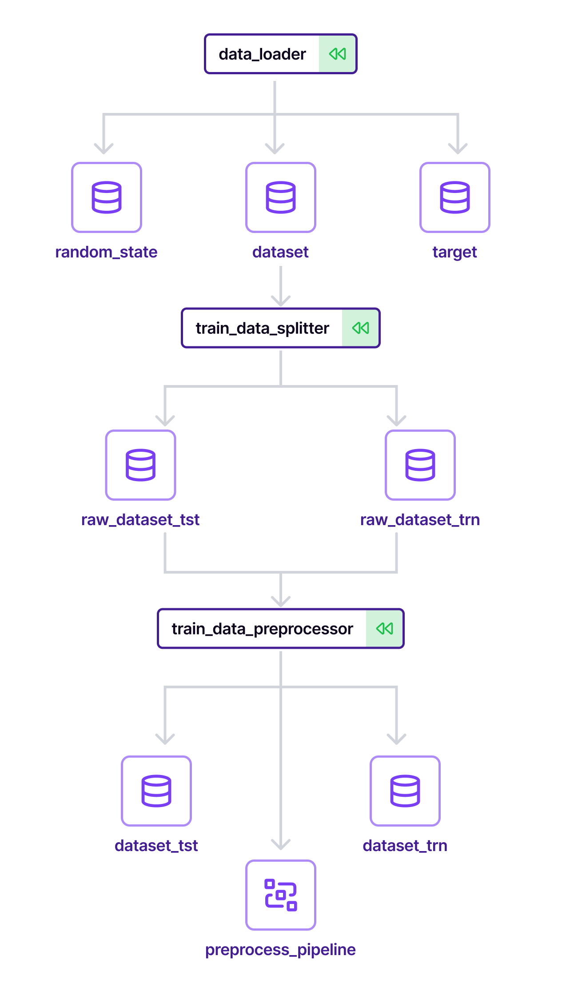
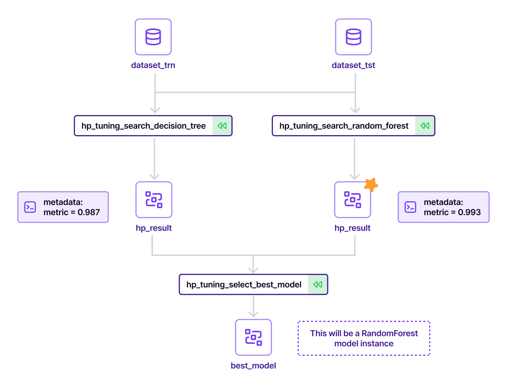
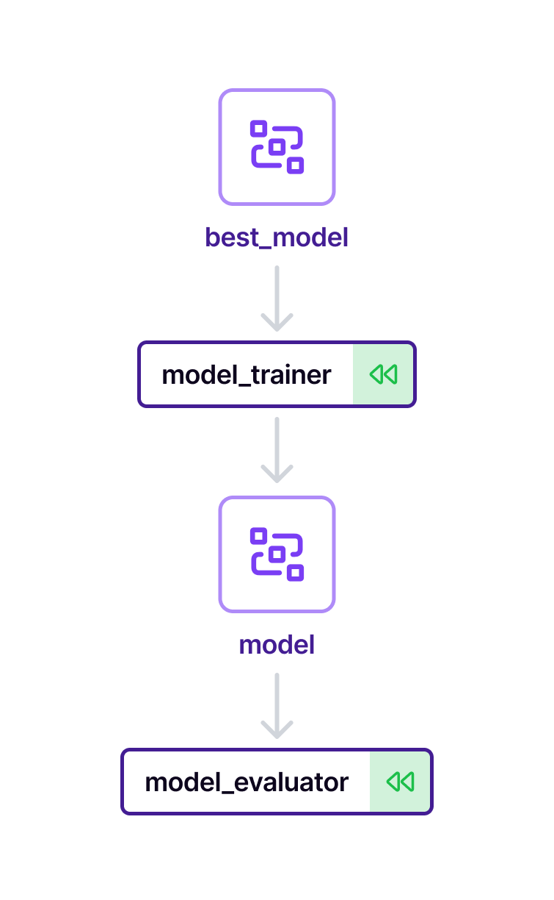
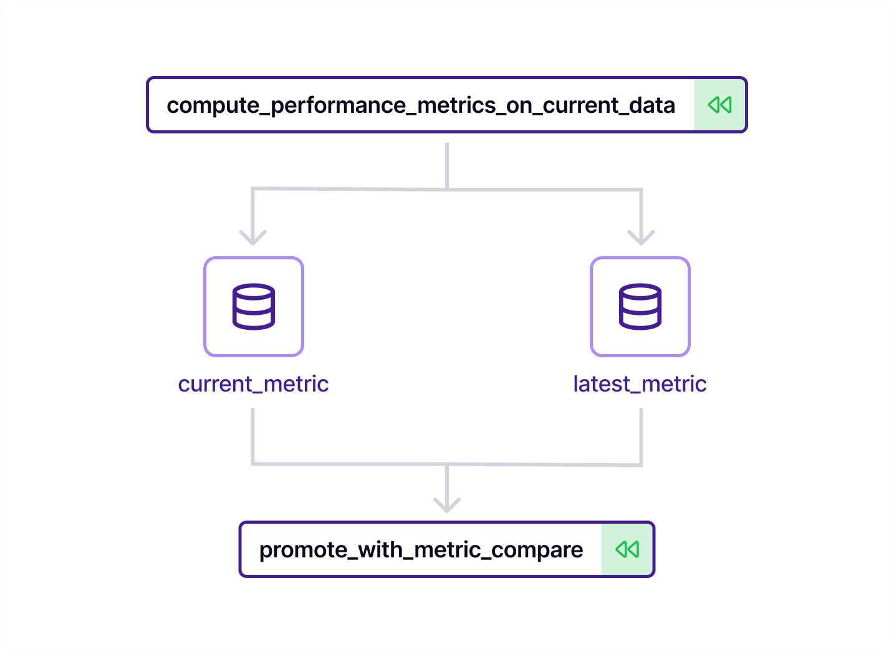
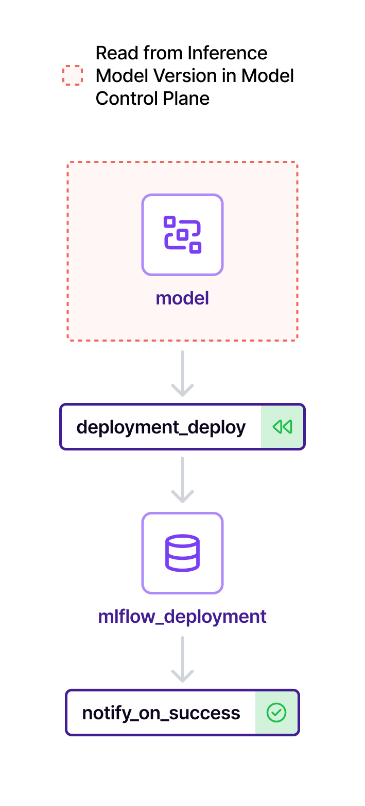
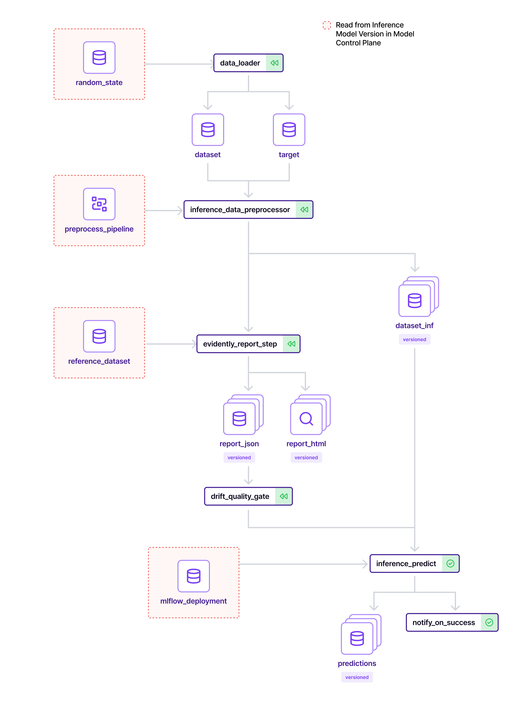

# Production-Grade MLOps Pipeline using ZenML

<p align="center">
  <a href="https://hub.docker.com/r/dvanhu/mlops-pipeline">
    
  </a>
  <a href="https://hub.docker.com/r/dvanhu/mlops-pipeline">
    
  </a>
  <a href="https://github.com/dvanhu/production-mlops-pipeline/actions">
    
  </a>
  </a>
  
  
  
  
  
  <a href="https://github.com/dvanhu/production-mlops-pipeline/blob/main/LICENSE">
    
  </a>
</p>

---

## Overview

This repository implements an end-to-end MLOps pipeline designed around the operational requirements of production ML systems: reproducible training runs, versioned artifacts, automated promotion gates, and monitored inference. The pipeline is not a demo — it is structured to handle the full model lifecycle from raw data ingestion to serving, with observable state at each stage.

The central problem this addresses is the gap between a model that works in a notebook and a model that can be reliably retrained, evaluated, compared, promoted, deployed, and monitored in a repeatable way. Each pipeline stage is an isolated, testable unit with defined inputs and outputs tracked through MLflow and coordinated through ZenML.

Three separate pipelines cover distinct concerns: training (ETL through promotion), deployment (registry-to-serving handoff), and batch inference (scored predictions with drift monitoring). The separation is intentional — each pipeline can be triggered independently, which matters when you need to redeploy without retraining or run batch scoring without touching the serving layer.

---

## Architecture

The system is composed of three pipelines that share preprocessing logic and interact through a central model registry. The diagram below shows how the pipelines connect:

<p align="center">
  
</p>

The training pipeline produces a candidate model and decides whether it should replace the current production model. The deployment pipeline takes a promoted model from the registry and exposes it for inference. The batch inference pipeline consumes the deployed model and applies drift detection to the incoming data before scoring.

---

## Pipeline Design

### Training Pipeline

The training pipeline runs from raw data through to a promotion decision. Each step is a ZenML step with its own artifact lineage.

#### ETL

<p align="center">
  
</p>

Raw data is ingested, validated against a schema, split into train/validation/test sets, and written as versioned artifacts. The preprocessing logic applied here is the same logic reused in the batch inference pipeline, ensuring the transformation contract is consistent across environments.

#### Hyperparameter Tuning

<p align="center">
  
</p>

A grid or random search is run over a defined parameter space using scikit-learn's cross-validation utilities. Each trial is logged as a child run in MLflow, with parameters, metrics, and the fitted estimator stored per trial. The best configuration is selected by validation metric and passed downstream.

#### Model Training

<p align="center">
  
</p>

A model is trained on the full training set using the optimal hyperparameters from the tuning step. The trained model is logged to MLflow with the training dataset hash, runtime environment, and evaluation metrics. The artifact is registered in the MLflow model registry under a versioned entry.

#### Model Promotion

<p align="center">
  
</p>

The newly trained model is compared against the currently deployed production model on a held-out test set. Promotion is conditional: if the challenger model meets or exceeds the baseline on the primary metric, it is transitioned to the `Production` stage in the MLflow registry. If it does not, the run is logged and the existing production model is retained. No manual intervention is required for standard retraining cycles.

---

### Deployment Pipeline

<p align="center">
  
</p>

The deployment pipeline queries the MLflow registry for the model currently in the `Production` stage and deploys it to a serving endpoint. This decouples the deployment trigger from the training pipeline — a model can be re-deployed without retraining, and deployment can be paused without halting training runs. The pipeline registers the active deployment in the ZenML stack context so downstream consumers can resolve the endpoint.

---

### Batch Inference Pipeline

<p align="center">
  
</p>

The batch inference pipeline runs on a scheduled or on-demand basis. It applies the same preprocessing steps as the training pipeline to ensure consistent feature transformations, then loads the production model to generate predictions. Before scoring, Evidently runs a data drift report comparing the incoming batch against the training reference dataset. If drift is detected above a configured threshold, the run is flagged in the MLflow tracking server. Predictions are written to a configured output sink alongside the drift report.

---

## Tech Stack

| Tool | Role |
|------|------|
| ZenML | Pipeline orchestration, artifact versioning, stack configuration |
| MLflow | Experiment tracking, model registry, run comparison |
| Evidently | Data drift detection and data quality reporting in batch inference |
| Scikit-learn | Model training, hyperparameter search, preprocessing |
| Docker | Containerized execution environment for reproducible runs |
| GitHub Actions | CI/CD for automated pipeline execution and image publishing |

---

## Docker Usage

The pipeline environment is published to Docker Hub. The image includes all dependencies and is the canonical execution environment for the pipeline.

**Pull the image:**

```bash
docker pull dvanhu/mlops-pipeline
```

**Run the pipeline:**

```bash
docker run --rm -v $(pwd)/mlruns:/app/mlruns dvanhu/mlops-pipeline
```

The volume mount (`-v $(pwd)/mlruns:/app/mlruns`) persists MLflow tracking data to the host. Without it, all experiment runs, logged metrics, and registered model artifacts are lost when the container exits. Mount this directory to any path where you want MLflow artifacts to accumulate across runs, and point your `MLFLOW_TRACKING_URI` to the same location when using the MLflow UI.

For custom configuration, override the default config at runtime:

```bash
docker run --rm \
  -v $(pwd)/mlruns:/app/mlruns \
  -v $(pwd)/configs/custom.yaml:/app/configs/training_config.yaml \
  dvanhu/mlops-pipeline
```

---

## Experiment Tracking

MLflow is used throughout the training pipeline. Each full training run creates a parent MLflow run. Hyperparameter tuning trials are logged as nested child runs under the parent, which allows direct comparison of all trials within the context of a single training cycle.

The following are logged per run:

- Hyperparameter values and the search space definition
- Training and validation metrics at each fold
- Final test set evaluation metrics (accuracy, F1, AUC, or as defined in config)
- The fitted model artifact, serialized with the scikit-learn MLflow flavor
- Dataset hash and split sizes for traceability
- Python environment snapshot via `mlflow.log_artifact` on `conda.yaml` / `requirements.txt`

The MLflow model registry manages model stage transitions (`Staging`, `Production`, `Archived`) and is the authoritative source for the deployment pipeline's model resolution.

To view the tracking UI against a local `mlruns` directory:

```bash
mlflow ui --backend-store-uri ./mlruns
```

---

## Data Quality and Drift Detection

Evidently is integrated into the batch inference pipeline. Before predictions are generated, a drift report is computed by comparing the incoming batch against a reference dataset saved during training (the training split, stored as an artifact in ZenML).

The report covers:

- Feature-level distribution shift (per-column drift scores using statistical tests appropriate to feature type)
- Dataset-level summary with an overall drift verdict
- Missing value and range anomaly checks

The report is saved as an HTML artifact and logged to the MLflow run associated with that inference batch. If the overall drift score exceeds the configured threshold, the run is tagged `drift_detected=true` in MLflow, and the batch is optionally held for review depending on the configured policy.

This provides a lightweight monitoring loop without requiring a separate observability platform.

---

## Project Structure

```
production-mlops-pipeline/
├── pipelines/          # ZenML pipeline definitions; each file wires steps into a pipeline DAG
├── steps/              # Individual ZenML steps (ETL, training, evaluation, promotion, inference)
├── configs/            # YAML configuration files for pipeline runs (hyperparameter space, thresholds)
├── utils/              # Shared utilities: preprocessing logic, metric helpers, registry clients
├── .assets/            # Architecture diagrams referenced in this README
├── .github/workflows/  # GitHub Actions CI/CD workflow definitions
├── Dockerfile          # Container build definition for the pipeline environment
├── requirements.txt    # Pinned Python dependencies
└── run.py              # Entry point for local pipeline execution
```

Each pipeline in `pipelines/` imports its steps from `steps/` and applies configuration from `configs/`. The `utils/` module contains preprocessing logic that is imported by both the training pipeline's ETL step and the batch inference pipeline, enforcing a single implementation of the transformation contract.

---

## Running Locally

**1. Clone the repository:**

```bash
git clone https://github.com/dvanhu/production-mlops-pipeline.git
cd production-mlops-pipeline
```

**2. Install dependencies:**

```bash
pip install -r requirements.txt
```

**3. Initialize ZenML:**

```bash
zenml init
zenml integration install mlflow scikit-learn -y
```

**4. Configure the ZenML stack:**

```bash
zenml experiment-tracker register mlflow_tracker --flavor=mlflow
zenml model-deployer register mlflow_deployer --flavor=mlflow
zenml stack register local_stack \
  -a default \
  -o default \
  -e mlflow_tracker \
  -d mlflow_deployer
zenml stack set local_stack
```

**5. Run the pipeline:**

```bash
python run.py
```

By default, `run.py` runs the full training pipeline. Pass flags to select a specific pipeline:

```bash
python run.py --pipeline training
python run.py --pipeline deployment
python run.py --pipeline batch_inference
```

---

## CI/CD Pipeline

The GitHub Actions workflow handles dependency installation, stack setup, pipeline execution, and image publication on each push to `main`.

**Workflow steps:**

1. **Install dependencies** — Restore pip cache and install from `requirements.txt`
2. **Setup ZenML stack** — Initialize ZenML with the local stack configuration and register MLflow integrations
3. **Run pipeline** — Execute the training pipeline; workflow fails if any step errors
4. **Build Docker image** — Build the image from `Dockerfile` using the repository state at the current commit SHA
5. **Push to Docker Hub** — Authenticate with stored secrets and push to `dvanhu/mlops-pipeline`, tagged with the commit SHA and `latest`

The workflow uses repository secrets `DOCKERHUB_USERNAME` and `DOCKERHUB_TOKEN` for registry authentication. The pipeline run in CI uses the local stack, which is sufficient for integration validation; production deployments against remote stacks require additional stack configuration in the workflow environment.

---

## Key Features

- Full artifact lineage tracked through ZenML from raw data to deployed model
- MLflow model registry controls promotion; no model reaches deployment without passing the comparison gate
- Preprocessing logic is defined once and reused across training and inference pipelines, eliminating training-serving skew at the transformation layer
- Drift detection runs inline with batch inference, not as a separate monitoring job
- Docker image published to Docker Hub on every successful CI run, providing a versioned execution environment per commit
- All pipeline configuration is externalized to YAML; retraining with different parameters requires no code changes
- Hyperparameter tuning trials are logged as nested MLflow runs, enabling direct comparison within a training cycle

---

## Limitations

- The default stack is local; there is no distributed compute, remote artifact store, or cloud-based orchestrator configured out of the box. Scaling to large datasets requires migrating to a remote ZenML stack (e.g., Kubernetes orchestrator with S3/GCS artifact store).
- The MLflow model server used for deployment is a local REST server, not a production-grade serving platform. Replacing it with a scalable serving layer (TorchServe, BentoML, Seldon, SageMaker) requires modifying the deployment pipeline step and ZenML model deployer integration.
- Batch inference drift detection uses a static training-set reference. Reference dataset rotation (e.g., rolling window baselines) is not implemented.
- There is no feature store integration; features are recomputed from raw data on each run rather than served from a versioned feature registry.
- The CI pipeline runs the training pipeline in full on each push, which is slow for large datasets. A lighter smoke-test mode with a data subset would improve CI iteration time.

---

## Future Improvements

- Replace the local ZenML stack with a remote stack backed by a cloud artifact store (S3/GCS) and a scalable orchestrator (Airflow or Kubernetes) to support larger datasets and parallel step execution
- Integrate a feature store (Feast or Tecton) to decouple feature computation from the training and inference pipelines
- Add online inference support alongside the existing batch pipeline, sharing the same model registry integration
- Implement reference dataset rotation in the drift detection step so that baselines stay relevant as data distribution evolves over time
- Add alerting on drift detection results via webhook or notification integration, rather than relying on manual MLflow log inspection
- Extend the promotion gate to include fairness and calibration metrics in addition to the primary performance metric
- Add a model card artifact generated at promotion time, documenting training data lineage, evaluation results, and known limitations

---

## Author

**dvanhu**

- GitHub: [github.com/dvanhu](https://github.com/dvanhu)
- Docker Hub: [hub.docker.com/r/dvanhu/mlops-pipeline](https://hub.docker.com/r/dvanhu/mlops-pipeline)
